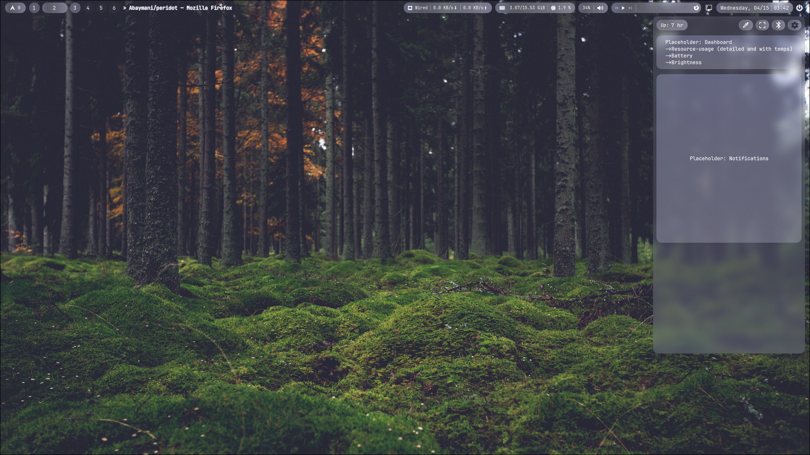

# PERIDOT(-files)

Personal 'WIP' dotfiles for Arch/Hyprland using Quickshell. With bits and pieces taken/inspired from [end4-dots](https://github.com/end-4/dots-hyprland), [ML4W](https://github.com/mylinuxforwork/dotfiles) and [Caelestia](https://github.com/caelestia-dots/shell). Project aim is just to learn quickshell and make something useable for myself by the end.



## Setup
To make git tracking easier, clone this repo to a folder separate from *~/.config* and create a symlink instead. This way, your git repo won't start tracking random app config folders.

```
ln -s ~/peridot/* ~/.config
```

In order for most config files to work properly, matugen needs to run at least once. If running waypaper, this will happen as soon as wallpaper is set for the first time. If not, the file *~/.config/peridot/settings/current_wallpaper.txt* needs to be created and given an image path. For example:

```
echo "/home/$USER/.config/peridot/peridot.jpg" > ~/.config/peridot/settings/current_wallpaper.txt
```


## TODO
### Quickshell Widgets & Applets
**Topbar ✅**

**Calendar**
- [ ] Simple calendar view
- [ ] Google calendar / ical integration

**Misc.**
- [ ] [Workspace overview / alt-tab](https://www.windowslatest.com/wp-content/uploads/2020/07/Alt-Tab-with-browser-tabs.jpg)
- [ ] Launcher (Rofi/Wofi replacement)
- [ ] Unified settings app
- [ ] On-screen Keyboard
- [ ] Emoji picker
- [x] Clipboard history viewer

**Control Center**
- [ ] Power profile override

**Notifications**
- [x] Rudimentary functionality (notifications visible in control center)
- [x] Popup notifications
- [x] images, icons and all other information is shown
- [x] Do-not-disturb toggle
- [ ] Notifications save to and are loaded from file

**Scripts & Utils**
- [x] Screenshot utility
- [x] Brightness utility

___

## Theming
Matugen is used extensively for theming. Some dependencies are required for GTK and Qt apps to apply themes correctly.

#### GTK
```
pacman -S adw-gtk-theme
```

#### Qt
```
yay -S breeze-icons breeze-gtk qt6ct-kde qt5ct-kde darkly-bin
```

#### Icons

Peridot uses [YAMIS](https://store.kde.org/p/2303161) for icons. It is bundled but a symlink is required.
``` 
mkdir -p ~/.local/share/icons/
ln -sfn ~/peridot/peridot/icons/YAMIS/ ~/.local/share/icons/YAMIS
```

___

Since I don't have an install script (yet) and have multiple setups, here are all the packages I use. **Some are hard-referenced or assumed by scripts**. I think I have bolded required packages below but no guarantee.

**Packages:**

7zip
**adw-gtk-theme**
awww
**brillo**
bibata-cursor-theme-bin
**blueman**
**breeze-gtk**
**breeze-icons**
cliphist
cmake
darkly-bin
fastfetch
ffmpegthumbnailer
firefox
fish
figlet
flatpak
font-manager
frameworkintegration
fzf
git
gnome-calculator
gnome-text-editor
**grim**
gum
htop
**hyprland**
**hyprlock**
**hyprpicker**
iwd
jq
**kitty**
loupe
**libpulse**
man-db
**matugen**
mesa-utils
mpv
nano
nautilus
ncdu
neovim
**network-manager-applet**
**networkmanager**
noto-fonts-cjk
noto-fonts-emoji
noto-fonts-extra
**ttf-jetbrains-mono-nerd**
ntfs-3g
nvidia-580xx-dkms
nvidia-settings
nwg-displays
nwg-look
obs-studio
openssh
**pacman-contrib**
**pavucontrol**
pipewire-pulse
polkit-kde-agent
**power-profiles-daemon**
qbittorrent
**qt5ct**
**qt6ct**
**quickshell**
sddm
**slurp**
smartmontools
starship
sudo
tldr
ttc-iosevka
unrar
unzip
uwsm
visual-studio-code-bin
vulkan-tools
waypaper-git
wget
**wl-clipboard**
**wlogout**
wlr-randr
wofi
xclip
xdg-desktop-portal-hyprland
**yay**
yay-debug
yazi